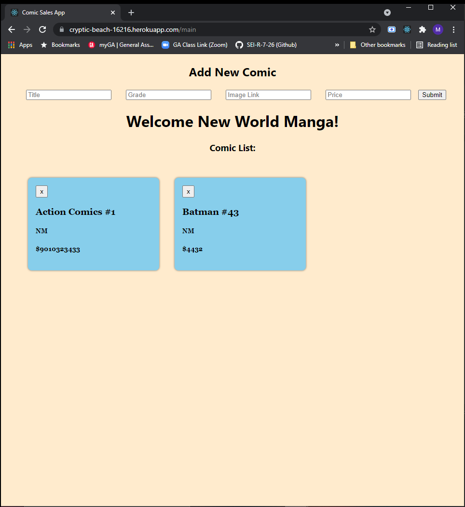

# Comic Sales App

## Date: 09/03/2021

### By: Max Arenstein

[Facebook](https://www.facebook.com/max.arenstein/) | [Twitter](https://twitter.com/MisterMindX) | [Github](https://github.com/MistermindX)

---

**_Description_**

This is a comic sales companion app for keeping track of stock for multiple users and calculating the price for a sale. It is deployed on Heroku here: [Heroku](https://cryptic-beach-16216.herokuapp.com/)

---

**_Technologies Used_**

- React
- Express
- MongoDB
- Node

---

**_Getting Started_**

When you open the site you will enter your username to see the list of comics you have in your database.

---

**_Screenshots_**

**_Future Updates_**

- [ ] Cart Function
- [ ] Logout Function
- [ ] Cookies Functionality to remember logins
- [ ] Bootstrap for better styling

---

**_Credits_**
